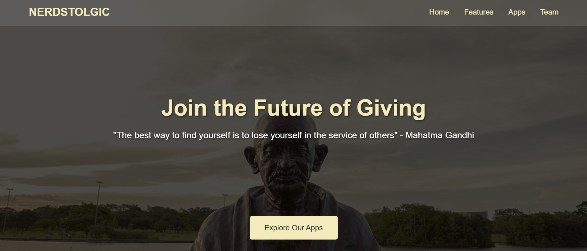
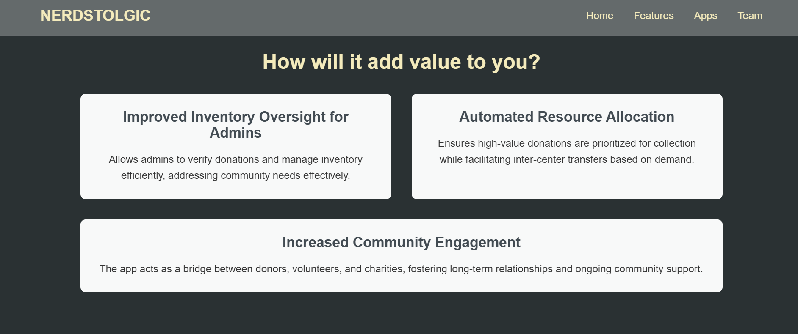
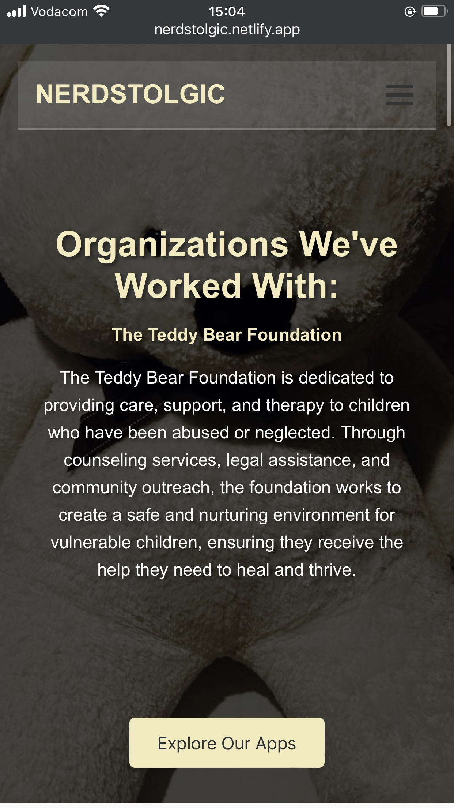

# 🎗️ Nerdstolgic - Donation Management System  
**An Advertisement Website Developed by Bonolo Moraka for Team Nerdstolgic's Project**  

  

## 📌 Overview  
This **advertisement website** was solely developed by **Bonolo Moraka** for **Team Nerdstolgic** as part of the **Informatics 3** course at the **University of Johannesburg**.  

The website showcases **Team Nerdstolgic's** project, a **Donation Management System** created for the [**Teddy Bear Foundation**](https://teddybearfoundation.org.za/), which aims to streamline the donation process by allowing users to:  
✅ Make physical donations securely from the comfort of their homes.  
✅ Track previous contributions.  
✅ Manage donor profiles.  
✅ Generate reports for transparency.  

---

## 🚀 Features  
The website has the following main sections accessible from the navigation menu:  
- **Home**: An overview of the project and what it entails, presented in the form of a carousel.  
- **Features**: Detailed description of the features offered by the **Donation Management System**.  
- **Apps**: Screenshots of both the mobile and web applications to demonstrate how users interact with the system.  
- **Team**: Information about the **Team Nerdstolgic** members, showing all 4 team members.  

---

## 🛠️ Technologies Used  
- **Frontend**: HTML5, CSS3, JavaScript  
- **Other Tools**: GitHub, VS Code  

---

## 📸 Screenshots  

### Web View  
  

### Mobile View  
  

---
## 📢 Acknowledgments
A huge thanks to the **Teddy Bear Foundation** who was our idea sponsor; **Mr Jarred Orfao** (our mentor), and **Mr Carl van der Westhuzen** (our lecturer), for their guidance throughout this project.

---
## 📬 Contact
For any inquiries or collaborations, feel free to reach out:
- 📧 [MyEmail](mailto:stringbonolo@gmail.com)
- 🔗 [My LinkedIn](https://www.linkedin.com/in/bonolo-moraka-13b87918b/)
